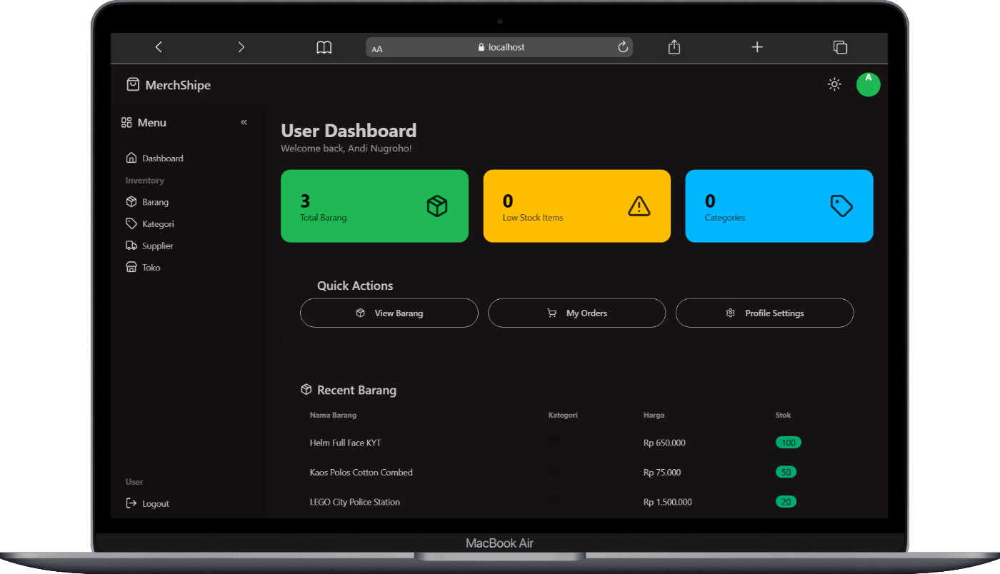

# MerchShipe - Sistem Manajemen Inventaris



Aplikasi web modern untuk mengelola inventaris dan peran pengguna dengan antarmuka yang bersih dan responsif dibangun menggunakan Tailwind CSS dan DaisyUI.

## 🚀 Fitur-fitur

- **UI Modern** dengan Tailwind CSS dan DaisyUI
- **Desain responsif** untuk mobile, tablet, dan desktop
- **Sistem otentikasi pengguna** (login, register, logout)
- **Kontrol akses berbasis peran** (admin/pengguna)
- **Manajemen inventaris komprehensif** (produk, kategori, supplier, toko)
- **Toggle mode gelap/terang**
- **Lucide Icons** untuk elemen UI
- **Manajemen sesi dan perlindungan CSRF**

## 📷 Tampilan Aplikasi

Berikut adalah tampilan dari aplikasi MerchShipe:


*Tampilan antarmuka aplikasi MerchShipe dengan desain responsif dan modern*

## 💻 Teknologi yang Digunakan

- **Frontend**: HTML5, CSS3, JavaScript
- **Framework**: Tailwind CSS + DaisyUI
- **Icons**: Lucide Icons
- **Backend**: PHP Native (Prosedural)
- **Database**: MySQL

## 📋 Instalasi & Pengaturan (Instruksi Terminal)

### Prasyarat

- XAMPP dengan Apache dan MySQL (disarankan) ATAU PHP 7.4+ dengan MySQL
- MySQL 5.7 atau lebih tinggi

### Metode 1: Menggunakan XAMPP (Disarankan)

1. **Navigasi ke direktori htdocs XAMPP Anda:**
   ```bash
   cd C:\xampp\htdocs  # Di Windows
   # ATAU
   cd /Applications/XAMPP/htdocs  # Di macOS
   # ATAU
   cd /opt/lampp/htdocs  # Di Linux
   ```

2. **Clone atau letakkan proyek Anda di htdocs:**
   ```bash
   git clone <your-repo-url> merchshipe
   # ATAU jika Anda memiliki file secara lokal, letakkan folder di htdocs
   ```

3. **Jalankan layanan XAMPP:**
   ```bash
   # Menggunakan XAMPP Control Panel (disarankan)
   # Jalankan layanan Apache dan MySQL

   # ATAU jalankan layanan menggunakan perintah (jika tersedia di PATH Anda)
   sudo /opt/lampp/lampp start  # Di Linux
   ```

### Metode 2: Menggunakan Server Bawaan PHP

1. **Navigasi ke direktori proyek:**
   ```bash
   cd C:\xampp\htdocs\merchshipe  # Di Windows
   # ATAU
   cd /path/to/merchshipe  # Di macOS/Linux
   ```

2. **Jalankan server bawaan PHP:**
   ```bash
   php -S localhost:8000
   ```

3. **Atur database secara terpisah:**
   - Pastikan MySQL berjalan di sistem Anda
   - Buat database dan impor skema seperti dijelaskan di bawah

### Pengaturan Database

4. **Atur database melalui terminal MySQL:**
   ```bash
   # Hubungkan ke MySQL (jika menggunakan XAMPP)
   mysql -u root -p

   # Masukkan password MySQL Anda ketika diminta (biasanya kosong untuk XAMPP)

   # Buat database
   CREATE DATABASE web_store_app;

   # Gunakan database
   USE web_store_app;

   # Keluar dari MySQL
   EXIT;
   ```

5. **Impor skema database:**
   - Salin konten SQL dari `setupdatabase.md` (dari CREATE TABLE hingga INSERT terakhir)
   - Eksekusi di tab SQL phpMyAdmin atau melalui command line MySQL:
   ```bash
   mysql -u root -p web_store_app < path/to/schema.sql
   ```

6. **Perbarui hash password (terminal PHP):**
   ```bash
   # Generate hash untuk admin123
   php -r "echo password_hash('admin123', PASSWORD_DEFAULT);"

   # Generate hash untuk user123
   php -r "echo password_hash('user123', PASSWORD_DEFAULT);"
   ```

   Lalu perbarui tabel users di database Anda dengan hash yang dihasilkan.

7. **Verifikasi konfigurasi:**
   - Periksa `config/database.php` memiliki nama database yang benar (`web_store_app`)
   - Konfigurasi default mengasumsikan:
     - Host: localhost
     - Database: web_store_app
     - User: root
     - Password: (kosong untuk default XAMPP)

## 🚀 Cara Menjalankan (Terminal & Browser)

### Metode 1: Menggunakan XAMPP (Disarankan)

1. **Jalankan layanan XAMPP:**
   - Buka XAMPP Control Panel
   - Jalankan layanan Apache dan MySQL
   - ATAU via terminal (Linux):
   ```bash
   sudo /opt/lampp/lampp start
   ```

2. **Verifikasi layanan berjalan:**
   ```bash
   # Periksa apakah Apache dan MySQL berjalan
   sudo /opt/lampp/lampp status  # Di Linux
   ```

3. **Akses aplikasi di browser Anda:**
   - Arahkan ke: `http://localhost/merchshipe`

### Metode 2: Menggunakan Server Bawaan PHP

1. **Jalankan server bawaan PHP:**
   ```bash
   # Navigasi ke direktori proyek terlebih dahulu
   cd /path/to/merchshipe

   # Jalankan server
   php -S localhost:8000
   ```

2. **Akses aplikasi di browser Anda:**
   - Arahkan ke: `http://localhost:8000`

### Login dengan Kredensial Default

**Pengguna Admin:**
- Username: `admin`
- Password: `admin123` (setelah mengatur hash bcrypt dengan benar)

**Pengguna Reguler:**
- Username: `user`
- Password: `user123` (setelah mengatur hash bcrypt dengan benar)

### Hentikan Layanan Saat Selesai

**Untuk XAMPP:**
```bash
sudo /opt/lampp/lampp stop  # Di Linux
# Atau gunakan XAMPP Control Panel
```

**Untuk Server Bawaan PHP:**
- Tekan `Ctrl+C` di terminal tempat server berjalan

## 🏗️ Struktur Proyek

```
merchshipe/
├── assets/
│   └── js/
│       └── main.js
├── views/
│   ├── header.php
│   ├── topnav.php
│   ├── sidebar.php
│   └── footer.php
├── config/
│   └── database.php
├── admin/
├── user/
├── barang/       # Manajemen produk
├── kategori/     # Manajemen kategori
├── supplier/     # Manajemen supplier
├── toko/         # Manajemen toko
├── .env
├── .gitignore
├── .htaccess
├── 403.php
├── favicon.ico
├── index.php
├── login.php
├── register.php
├── logout.php
├── README.md
└── setupdatabase.md
```

## 🔐 Catatan Keamanan

- **Ubah password default** segera setelah instalasi
- **Atur hash bcrypt dengan benar** untuk pengguna default
- **Validasi dan sanitasi semua input pengguna**
- **Perbarui kredensial database** sebelum penggunaan produksi
- **Pertimbangkan implementasi rate limiting** untuk percobaan login

## 🛠️ Kustomisasi

Untuk menyesuaikan aplikasi:
1. Modifikasi kelas CSS di file HTML sesuai preferensi desain Anda
2. Perbarui atribut `data-theme` di tag body untuk mengubah skema warna
3. Tambah atau modifikasi item menu di `views/sidebar.php` sesuai kebutuhan Anda
4. Perluas fungsionalitas dengan membuat modul baru di direktori yang sesuai

## 🔧 Troubleshooting

**Masalah: Error koneksi database**
- Solusi: Verifikasi kredensial database Anda di `config/database.php`
- Pastikan MySQL berjalan di XAMPP Control Panel

**Masalah: Halaman tidak ditemukan atau error .htaccess**
- Solusi: Pastikan modul mod_rewrite Apache diaktifkan di XAMPP
- Di XAMPP Control Panel, klik tombol Config di samping Apache dan pastikan rewrite_module dicentang

**Masalah: File CSS/JS tidak dimuat**
- Solusi: Periksa apakah link CDN Tailwind CSS dan DaisyUI berfungsi
- Verifikasi bahwa semua path aset benar

**Masalah: Login gagal dengan kredensial default**
- Solusi: Pastikan Anda telah mengatur hash password bcrypt dengan benar di database
- Generate hash baru menggunakan fungsi `password_hash()` PHP

## Author

- **Nama**: [Andi Nugroho](https://github.com/pierredior)
- **Kontak**: [andidelouise@gmail.com](mailto:andidelouise@gmail.com)
